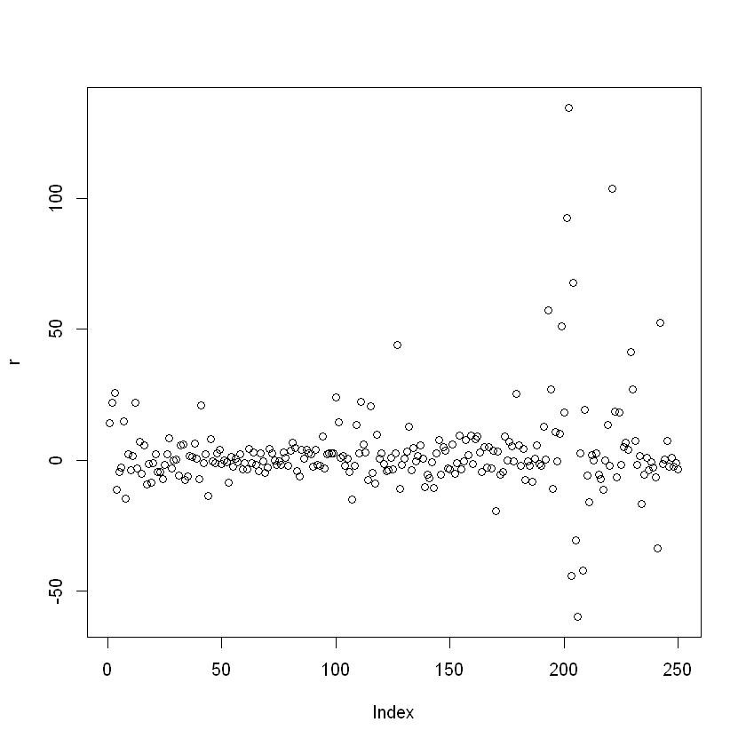
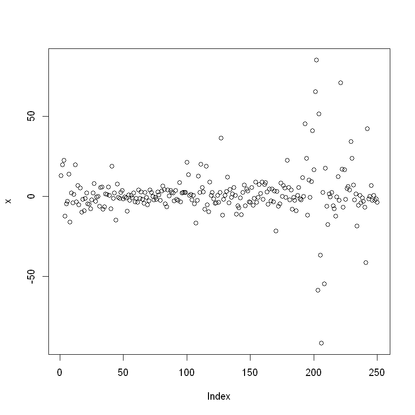
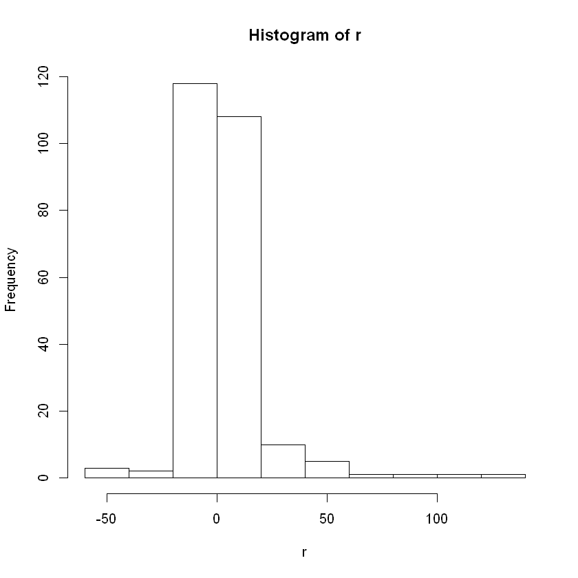
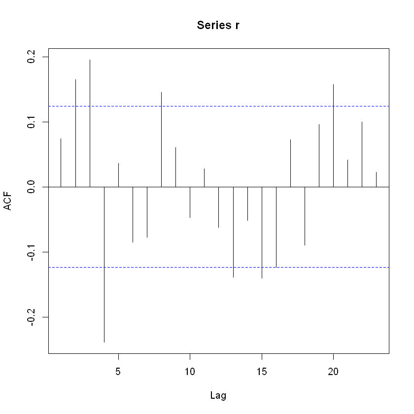
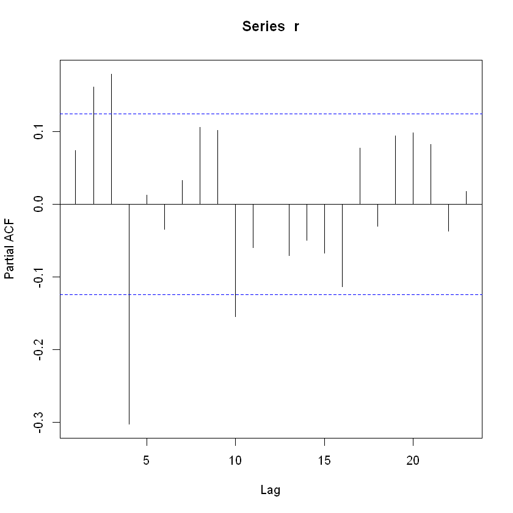
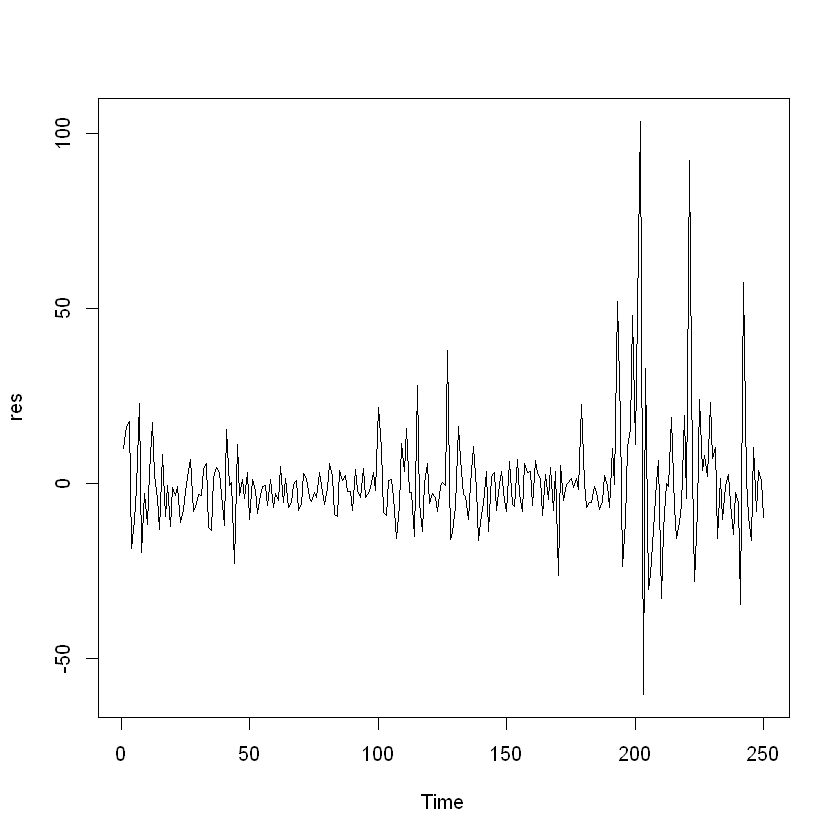
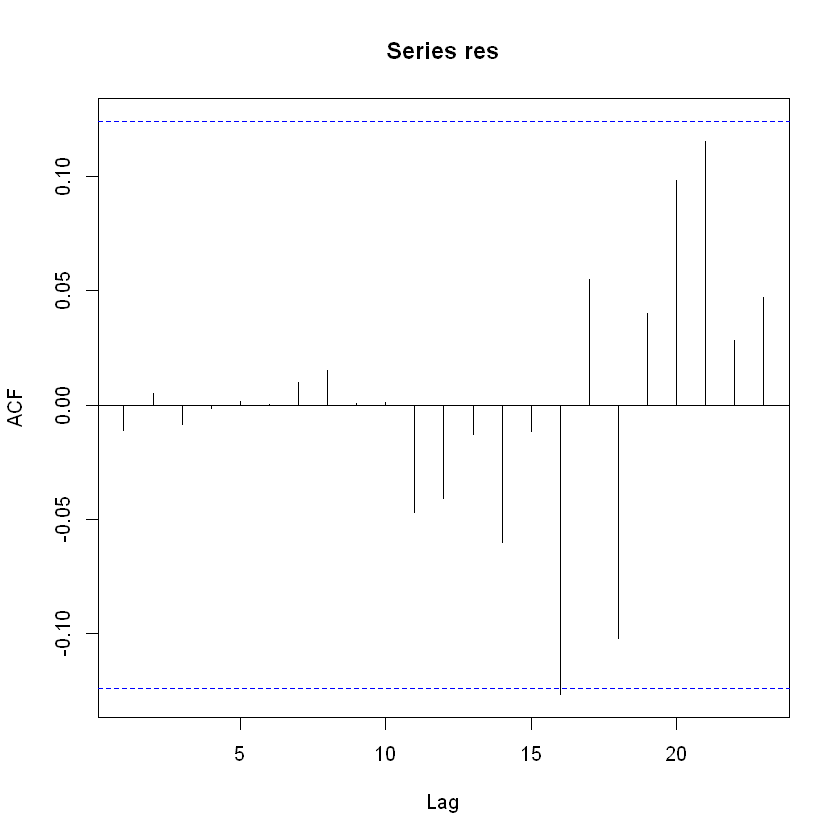
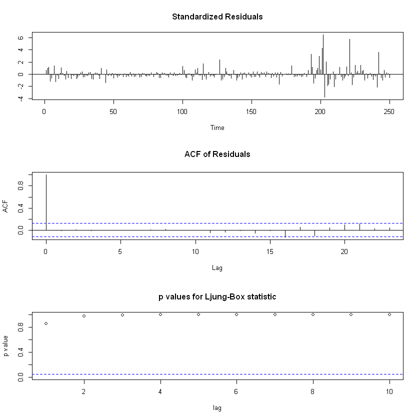
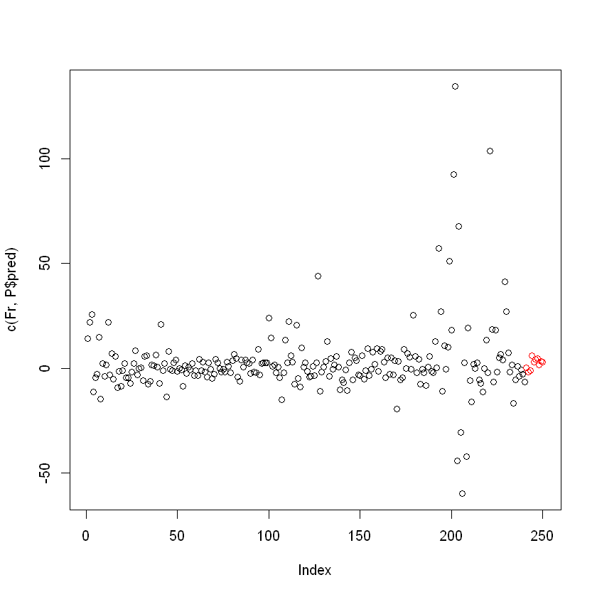
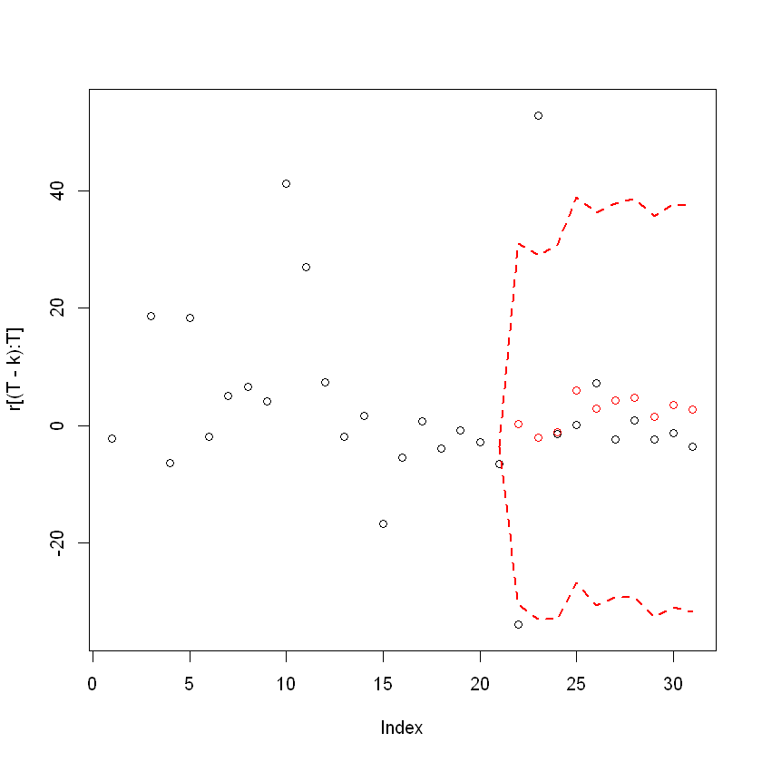

# GameStop Study in R

I've decided to analyse and study the action of Gamestop, more precisely the adjusted closure after the big raise that happened in February 2021.
I consider a daily analysis and picked a whole year, as time window, to get enough data.
The dataset has been taken by yahoo finance and can be updated by downloaded by https://it.finance.yahoo.com/quote/GME/history?p=GME

## Useful Information
Please note that with linear modeling (Arima) we assume the timeseries has a recurring pattern in its behaviour, therefore it might not be suitable to use Arima to model a time series which has had a big one off shock withios in this case. However this is just an example of a study for a project.

## Installation
```R
library(ggplot2)
library(TSA)
library(forecast)
```

## First Analysis
```R
GME=read.csv("GME.csv",sep=",");
GME=data.frame(GME$Date,GME$Adj.Close)
dt=as.Date(GME$GME.Date, format="%Y-%m-%d");
X=GME$GME.Adj.Close
GMEg= ggplot(GME, aes(x = dt, y = X)) + geom_line() +
  labs(title="Adjusted Closure of GME in the last year", x="Months", y="Value") +
  scale_x_date(breaks = pretty(dt,n=10),date_labels = "%m");
GMEg
```


From the plot we can see that the progression for most of time is stable, from semptember it start growning a bit, untile january where we can see a big spike, and after that it starts moving a lot up and down.


```R
T = length(dt);
r = ((X[2:T]-X[1:(T-1)])/X[1:(T-1)])*100
plot(r)
```





Here as before we can see that most of time the simple percentage return is near zero. We can see an exception on the last days of the study where there is a volatility cluster.


```R
x = diff(log(X))*100
plot(x)
```





The log return percentage is very similar to the simple one.

## Analysis of the return
```R
library(fBasics)
hist(r)
```





```R
basicStats(r)
s1 = skewness(r)[1]; s1
t1 = s1/sqrt(6/length(r))
pv = 2*(1-pnorm(t1))
pv
t.test(x)
normalTest(x,method="jb")
```


<table class="dataframe">
<caption>A data.frame: 16 × 1</caption>
<thead>
	<tr><th></th><th scope=col>r</th></tr>
	<tr><th></th><th scope=col>&lt;dbl&gt;</th></tr>
</thead>
<tbody>
	<tr><th scope=row>nobs</th><td>250.000000</td></tr>
	<tr><th scope=row>NAs</th><td>  0.000000</td></tr>
	<tr><th scope=row>Minimum</th><td>-60.000000</td></tr>
	<tr><th scope=row>Maximum</th><td>134.835802</td></tr>
	<tr><th scope=row>1. Quartile</th><td> -3.347393</td></tr>
	<tr><th scope=row>3. Quartile</th><td>  4.757696</td></tr>
	<tr><th scope=row>Mean</th><td>  2.832840</td></tr>
	<tr><th scope=row>Median</th><td>  0.195741</td></tr>
	<tr><th scope=row>Sum</th><td>708.209952</td></tr>
	<tr><th scope=row>SE Mean</th><td>  1.108859</td></tr>
	<tr><th scope=row>LCL Mean</th><td>  0.648901</td></tr>
	<tr><th scope=row>UCL Mean</th><td>  5.016779</td></tr>
	<tr><th scope=row>Variance</th><td>307.392192</td></tr>
	<tr><th scope=row>Stdev</th><td> 17.532604</td></tr>
	<tr><th scope=row>Skewness</th><td>  3.234629</td></tr>
	<tr><th scope=row>Kurtosis</th><td> 20.206332</td></tr>
</tbody>
</table>


3.2346288400622


0


    
    	One Sample t-test
    
    data:  x
    t = 1.6369, df = 249, p-value = 0.1029
    alternative hypothesis: true mean is not equal to 0
    95 percent confidence interval:
     -0.3215156  3.4854378
    sample estimates:
    mean of x 
     1.581961 
    


    
    Title:
     Jarque - Bera Normalality Test
    
    Test Results:
      STATISTIC:
        X-squared: 1734.6067
      P VALUE:
        Asymptotic p Value: < 2.2e-16 
    
    Description:
     Sun Jan 23 17:37:21 2022 by user: Mattia
    


We can easily see, from the result of the function basicStats, that we the skewness is not zero and that the kurtosis is much bigger that 3. One particular thing, that we can notice from this study, other than the fact that our distribution is not normal having p-value equal to $2.2e-16$, is that the mean is not significally different from zero. This is mainly because, although the mean is equal to 2.832840, the variance is very high.\
We did this by considering as test for skewness: the null hypothesis equal to $S=0$ and the test statistic:

)


```R
acf(r); #autocorrelation function
```





```R
pacf(r); #partial autocorrelation function
```





```R
Box.test(r,lag = log(length(r)),type="Ljung-Box")
```


    
    	Box-Ljung test
    
    data:  r
    X-squared = 33.084, df = 5.5215, p-value = 6.269e-06
    


We have already the idea that our return are not white noise, we use this this analysis to confirm it.\
We see that in both graphics there are some spikes, more precisely, in the pacf's graph, we see that we have the higher values in 2,3,4 and 10, so we will use this lags for our future analysis.\
Finally we look at the results from the Box.test to confirm that our data are not White Noise.

Firstly we use the Akaike's information criterior to choose the number of parameters for our autoregressive model, then we find the characteristic roots of the equation.

## Model
```R
ar(r)$aic
M=Arima(r,order = c(10,0,0))
M=Arima(r,order = c(4,0,0),fixed=c(0,NA,NA,NA,NA))
roots = polyroot(c(1,-M$coef[1:4])) 
croots = 1/roots
Mod(croots)
```

<ol class=list-inline><li>0.673277056426473</li><li>0.795040188963044</li><li>0.795040188963044</li><li>0.673277056426473</li></ol>


We see that the number of our parameter would be 0, but by studying the AIK and the BIC we can notice that the AR(4) is more parsimonius and it have similar value. Therefore we will consider AR(4), with the first parameter fixed to 0, as it is not significant.
Moreover the modulus of our characteristic roots is always smaller than 1, so our series is stationary. In the end we analyse the residuals.

```R
res = M$residuals
plot(res)
```





```R
acf(res)
```





```R
Box.test(res,lag = 25, fitdf=4)
tsdiag(M)
normalTest(res,method="jb")
```


    
    	Box-Pierce test
    
    data:  res
    X-squared = 31.149, df = 21, p-value = 0.07122
    


    
    Title:
     Jarque - Bera Normalality Test
    
    Test Results:
      STATISTIC:
        X-squared: 4117.8796
      P VALUE:
        Asymptotic p Value: < 2.2e-16 
    
    Description:
     Tue Jan 25 00:14:22 2022 by user: Mattia
    




We can see that they are not a serially correlated sequence, and they not normally distributed.

To conclude the project, we will use the function predict to forecast our series.

```R
T=length(r)
t=T-10
Fr=r[1:t]
FM=Arima(Fr,order = c(4,0,0),fixed=c(0,NA,NA,NA,NA))
P = predict(FM,10)                           
ls.str(P)                                      
plot(c(Fr,P$pred))
points(c(rep(NA,240),P$pred),col="red")
```


    pred :  Time-Series [1:10] from 241 to 250: 2.977 0.784 2.69 5.382 2.393 ...
    se :  Time-Series [1:10] from 241 to 250: 16.1 16.1 16.4 16.8 17.3 ...





```R
MR=max(r[t:T])
mR=min(r[t:T])

k = 30;
plot(r[(T-k):T],ylim=c(mR-1,MR+1))
points(c(rep(NA,k-10+1),P$pred),col="red")
lines(c(rep(NA,k-10),x[T],P$pred+1.96*P$se),col="red",lwd=2,lty=2)
lines(c(rep(NA,k-10),x[T],P$pred-1.96*P$se),col="red",lwd=2,lty=2)
```




In the end we can see that, except from the first two data, the other one are similar and inside the prediction interval of 95%.
I don't think that this prediction model is good. It is good when the behaviour is constant but when the returns get strange value then the prediction is completely wrong

```R

```
